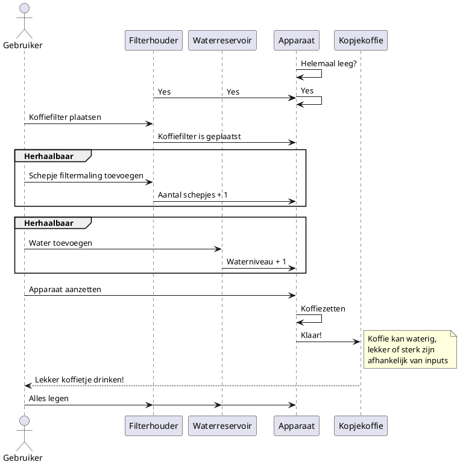

# Diagram

```plantuml

@startuml 
actor Gebruiker
participant Filterhouder
participant Waterreservoir
participant Apparaat
participant Kopjekoffie
!pragma teoz true

Apparaat -> Apparaat : Helemaal leeg?
Filterhouder -> Apparaat : Yes
& Waterreservoir -> Apparaat : Yes
& Apparaat -> Apparaat : Yes

Gebruiker -> Filterhouder : Koffiefilter plaatsen
Filterhouder -> Apparaat : Koffiefilter is geplaatst

Group Herhaalbaar

    Gebruiker -> Filterhouder : Schepje filtermaling toevoegen
    Filterhouder -> Apparaat : Aantal schepjes + 1

end

Group Herhaalbaar

    Gebruiker -> Waterreservoir : Water toevoegen
    Waterreservoir -> Apparaat : Waterniveau + 1

end

Gebruiker -> Apparaat : Apparaat aanzetten
Apparaat -> Apparaat : Koffiezetten

Apparaat -> Kopjekoffie : Klaar!
note right
Koffie kan waterig,
lekker of sterk zijn
afhankelijk van inputs
end note

Kopjekoffie --> Gebruiker : Lekker koffietje drinken!

Gebruiker -> Filterhouder : Alles legen
& Gebruiker -> Waterreservoir
& Gebruiker -> Apparaat

@enduml
```

