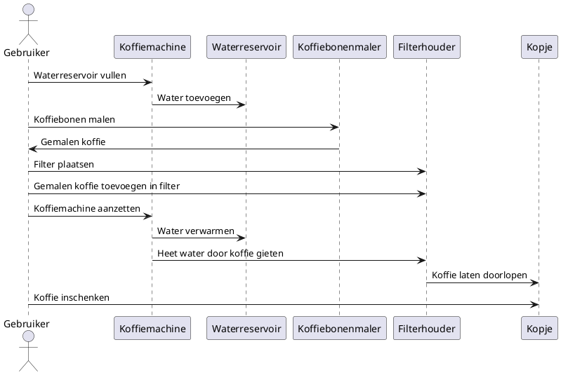

# Chapter 1

```plantuml

@startuml 
actor Gebruiker
participant "Koffiemachine" as Machine
participant "Waterreservoir" as Reservoir
participant "Koffiebonenmaler" as Maler
participant "Filterhouder" as Filter
participant "Kopje" as Kopje

Gebruiker -> Machine: Waterreservoir vullen
Machine -> Reservoir: Water toevoegen

Gebruiker -> Maler: Koffiebonen malen
Maler -> Gebruiker: Gemalen koffie

Gebruiker -> Filter: Filter plaatsen
Gebruiker -> Filter: Gemalen koffie toevoegen in filter

Gebruiker -> Machine: Koffiemachine aanzetten
Machine -> Reservoir: Water verwarmen
Machine -> Filter: Heet water door koffie gieten
Filter -> Kopje: Koffie laten doorlopen

Gebruiker -> Kopje: Koffie inschenken

@enduml
```