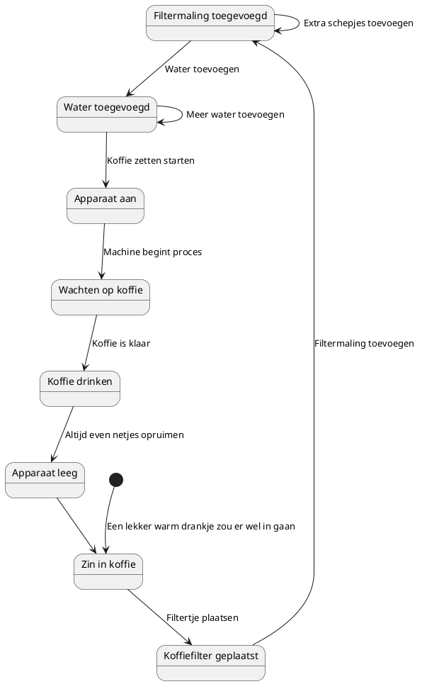

# Diagram Herkansing

```plantuml

@startuml
state "Zin in koffie" as Zin
state "Apparaat leeg" as Leeg
state "Koffiefilter geplaatst" as Filter
state "Filtermaling toegevoegd" as Maling
state "Water toegevoegd" as Water
state "Apparaat aan" as Aanzetten
state "Wachten op koffie" as Wachten
state "Koffie drinken" as Drinken

[*] --> Zin : Een lekker warm drankje zou er wel in gaan
Zin --> Filter : Filtertje plaatsen
Filter --> Maling : Filtermaling toevoegen
Maling -> Maling : Extra schepjes toevoegen 
Maling --> Water : Water toevoegen
Water -> Water : Meer water toevoegen
Water --> Aanzetten : Koffie zetten starten
Aanzetten --> Wachten : Machine begint proces
Wachten --> Drinken : Koffie is klaar
Drinken --> Leeg : Altijd even netjes opruimen
Leeg --> Zin
@enduml


```
