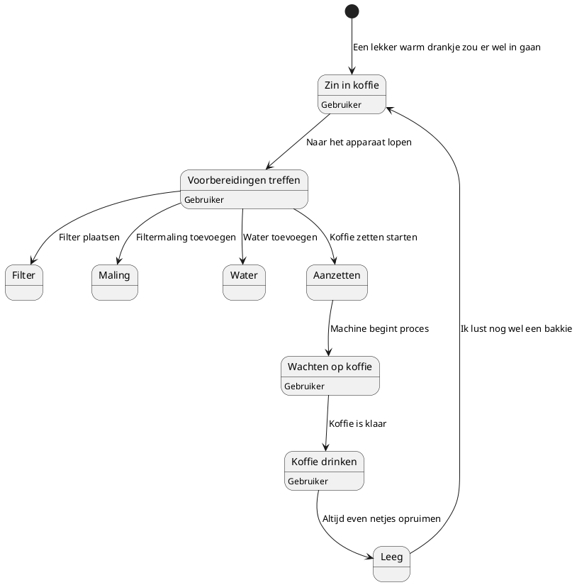

# Diagram Herkansing

```plantuml

@startuml
state "Zin in koffie" as Zin : Gebruiker
state "Voorbereidingen treffen" as Voorbereiden : Gebruiker
state "Wachten op koffie" as Wachten : Gebruiker
state "Koffie drinken" as Drinken : Gebruiker

[*] --> Zin : Een lekker warm drankje zou er wel in gaan
Zin --> Voorbereiden : Naar het apparaat lopen
Voorbereiden --> Filter : Filter plaatsen
Voorbereiden --> Maling : Filtermaling toevoegen 
Voorbereiden --> Water : Water toevoegen
Voorbereiden --> Aanzetten : Koffie zetten starten
Aanzetten --> Wachten : Machine begint proces
Wachten --> Drinken : Koffie is klaar
Drinken --> Leeg : Altijd even netjes opruimen
Leeg --> Zin : Ik lust nog wel een bakkie
@enduml


@startuml
state "Apparaat leeg" as Leeg : Apparaat
state "Koffiefilter geplaatst" as Filter : Apparaat
state "Filtermaling toegevoegd" as Maling : Apparaat
state "Water toegevoegd" as Water : Apparaat
state "Apparaat aan" as Aanzetten : Apparaat
state "Koffie is klaar!" as Klaar : Apparaat

Leeg --> Filter 
Filter --> Maling
Maling --> Water
Water --> Aanzetten
Aanzetten --> Klaar
Aanzetten --> Leeg


@enduml

```
