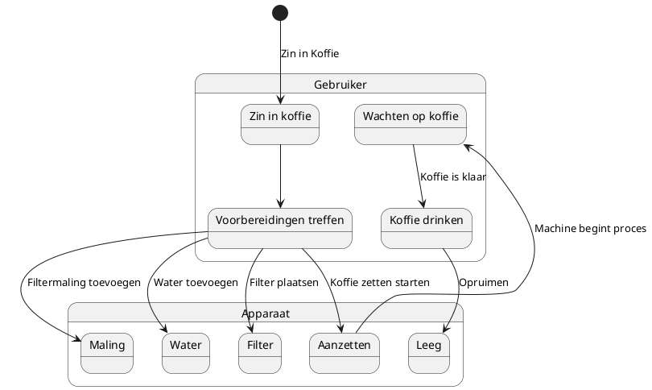

# Diagram Herkansing Test

```plantuml

@startuml
state "Zin in koffie" as Gebruiker.Zin
state "Voorbereidingen treffen" as Gebruiker.Voorbereiden
state "Wachten op koffie" as Gebruiker.Wachten
state "Koffie drinken" as Gebruiker.Drinken

[*] --> Zin : Zin in Koffie
Zin --> Voorbereiden
Gebruiker.Voorbereiden --> Apparaat.Filter : Filter plaatsen
Gebruiker.Voorbereiden --> Apparaat.Maling : Filtermaling toevoegen 
Gebruiker.Voorbereiden --> Apparaat.Water : Water toevoegen
Gebruiker.Voorbereiden --> Apparaat.Aanzetten : Koffie zetten starten
Apparaat.Aanzetten --> Gebruiker.Wachten : Machine begint proces
Gebruiker.Wachten --> Gebruiker.Drinken : Koffie is klaar
Gebruiker.Drinken --> Apparaat.Leeg : Opruimen
@enduml


@startuml
state "Apparaat leeg" as Apparaat.Leeg
state "Koffiefilter geplaatst" as Apparaat.Filter
state "Filtermaling toegevoegd" as Apparaat.Maling
state "Water toegevoegd" as Apparaat.Water
state "Apparaat aan" as Apparaat.Aanzetten
state "Koffie is klaar!" as Apparaat.Klaar

Leeg --> Filter 
Filter --> Maling
Maling --> Water
Water --> Aanzetten
Aanzetten --> Klaar
Aanzetten --> Leeg

@enduml

```
